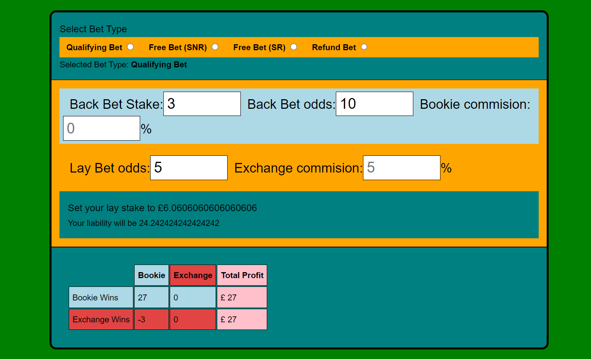
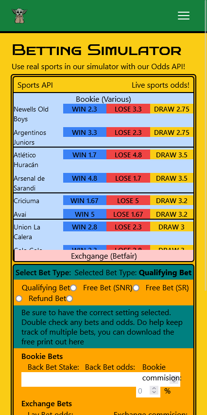

# Matched Betting Simulator

Macthed betting training is designed to teach you how to make a free bet from a bookie to guarntee a small profit.

Using online API to get real time bookie odds for the betting simulator.
Player practice bank accounts for a sandbox betting experience.

This app is deployed at [Matched Betting Simulator](https://clever-rolypoly-136b82.netlify.app/)
Check out the calculator
## Table of contents

- [Matched Betting Simulator](#matched-betting-simulator)
  - [Table of contents](#table-of-contents)
  - [General info](#general-info)
  - [Main Features](#main-features)
  - [Technologies](#technologies)
  - [Run this project locally](#run-this-project-locally)
  - [Design Information](#design-information)

## General info

Contains a specialised calculator that works out the correct amount to bet based on two different sets of odds.

Server deployment with Vercel @ [https://webdesignsbytom-app.vercel.app/](https://webdesignsbytom-app.vercel.app/)

## Main Features

The matched betting calculator uses several different formulas to tell you exactly what bets to make

API

## Technologies

App developed with:

Frontend: React, JavaScript, Tailwind, Axios, validator

Backend: Express, Prisma, JavaScript,

## Run this project locally

1. Fork this repository and clone the fork to your machine.
2. Navigate to client and server files and run
3. `npm install`
4. `npm start`

## Design Information

1. Link to ERD [ERD...](https://github.com/webdesignsbytom/matchedBetting-tailwind/blob/main/assets/ERD)
2. Original Design sketches [Sketch](https://github.com/webdesignsbytom/matchedBetting-tailwind/tree/main/assets/wireframe)
3. Odds API endpoints [API](https://the-odds-api.com/liveapi/guides/v4/#parameters-2)
